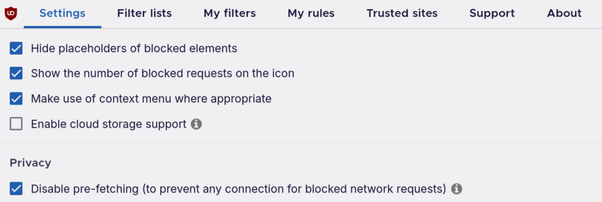

# Debloat YouTube (with uBlock Origin)

> A series of [ublock origin](https://ublockorigin.com/) filters to debloat the youtube website interface.

### Usage

1. Install [uBlock
   Origin](https://addons.mozilla.org/en-US/firefox/addon/ublock-origin/),
   a well-reputed Firefox content blocker.
2. Click the uBlock Origin extension (red shield icon) in the
   browser bar.
   - 
3. It should pop up with a large power button, you'll want to
click the settings (gears) icon at the bottom right of that pop
up.
4. That should bring you to a settings page:
   - 
5. Click on the "My Filters" tab at the top.
6. Copy the filter configuration (code to specify what to remove
from a webpage) from [this
url](https://raw.githubusercontent.com/LQR471814/debloat-youtube/refs/heads/main/filters.txt)
into the text box.
7. Click "Save" and reload any YouTube pages, you should now
notice that many parts of the webpage are now gone.

### Features (a non-exhaustive list)

- Removes shorts
- Removes subscriptions/notifications
- Removes view counts/sub counts/like counts
- Removes comments/live chat replay
- Removes "mixed for you playlists"
- Removes "music in this video" / other "structured information" in the description

### Justification

The main goal of these filter lists is to **remove non-substantive "bloat information" from youtube** and:

1. Free your attention to focus on the content of the videos.
2. Improve the aesthetic feeling of using the site by clearing the clutter.

Here are some more detailed explanations for certain features:

- Why are shorts removed?
   - They waste time, offer very little in terms of substantive information, and if you don't use them, they take up unnecssarily large amounts of space.
- Why are view counts/sub counts/likes/comments removed?
   - Things like view counts, likes/dislike counts, or comments can subtly inform you of "what you should think" about the content you view on YouTube rather than letting you to form opinions about the content itself.
   - The comments section is also especially harmful as it often leads to unproductive discussions, increased division and emotional distress, along with lots of wasted time.
- Why is "music in this video" / other "structured information" in the description removed?
   - The information is often wrong or unnecessary (like it was obvious), so it's just wasting space.

If you didn't use it already, [sponsorblock](https://sponsor.ajay.app/) is another good extension to cut out bloat information from inside videos.

